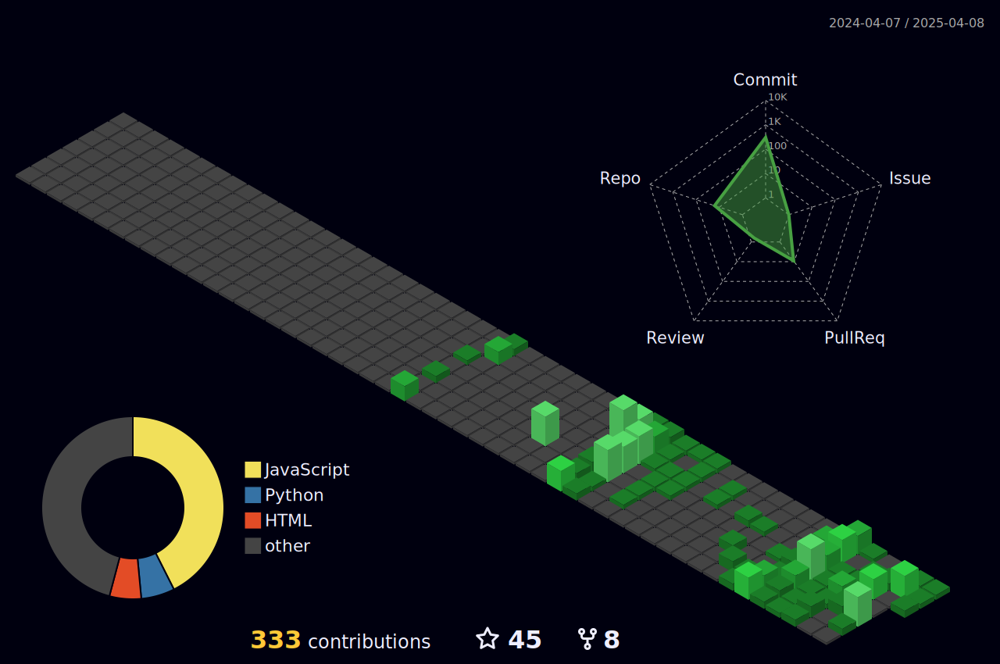

<h1 align="center">Hi , I'm Abhishek Singh</h1>

<h3 align="center">A Passionate Full Stack Web Developer from India</h3>

  

- 🔭 I’m currently working on **careertronics.in**

- 🌱 I’m currently learning **Three.js,DSA**

- 💬 Ask me about **javaScript,React,Python,C++**

- 📫 reach me @  **abhi120730@gmail.com**

- 👯 I’m looking to collaborate on **on open-source projects related to Web Development**

- 👀 I’m interested in **Web Development, Blockchain, and DSA**
  
- ⚡ Fun fact **I am a Funny webber🕸️🕸️**

  

  
  
  

<h2 align='center'><i>Socials and Coding Profiles 💻</i></h2>

   

 

  
  
  
</a>

  

<h2 align='center'><i>Languages, Tools and Technologies 🚀 </i></h2>

  

 
<table>
	<tr>
		<td><strong>Programming Languages</strong></td>
		<td></td>
	</tr>
	<tr>
		<td><strong>Frontend Development</strong></td>
		<td></td>
	</tr>
	<tr>
		<td><strong>Backend Development</strong></td>
		<td></td>
	</tr>
	<tr>
	<tr>
		<td><strong>Database Technologies</strong></td>
		<td></td>
	</tr>
	<tr>
		<td><strong>Frameworks</strong></td>
		<td></td>
	</tr>
	<tr>
		<td><strong>Cloud Deployment</strong></td>
		<td></td>
	</tr>
	<tr>
		<td><strong>Hosting Services</strong></td>
		<td></td>
	</tr>
	<tr>
		<td><strong>Developer Tools</strong></td>
		<td> 
	</td>
	</tr>
	<tr>
		<td><strong>Debugging Tools</strong></td>
		<td>  &nbsp; &nbsp; &nbsp; &nbsp;</td>
	</tr>
	<tr>
		<td><strong>Collaboration Platforms</strong></td>
		<td>  </td>
	</tr>
	<tr>
		<td><strong>Operating System</strong></td>
		<td>
		  </a>  <a href="https://www.cprogramming.com/" target="_blank" rel="noreferrer">
		</td>
	</tr>
</table>

  

</table>

<h2 align='center'><i>Github Analytics ⚙️</i></h2>

  

<markdown-accessiblity-table data-catalyst="">
  <table style="width: 100%; background-color: #1e1e1e; color: white; table-layout: fixed;">
    <thead>
      <tr>
        <th style="padding: 20px; text-align: center;">
          
        </th>
        <th style="padding: 20px; text-align: center;">
          
        </th>
      </tr>
    </thead>
	    <tr>
        <td colspan="2" align="center"></a></td>
    </tr>
  </table>
  
</markdown-accessiblity-table>

  

